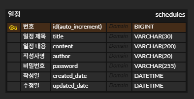

## 일정 관리 앱

#### 공통조건
- 3 Layer Architecture에 따라 각 Layer의 목적에 맞게 개발
- CRUD 필수 기능은 모두 데이터베이스 연결 및 JPA를 사용해서 개발
- 일정 작성, 수정, 조회 시 반환 받은 일정 정보에 비밀번호는 제외
- 일정 수정, 삭제 시 선택한 일정의 비밀번호와 요청할 때 함께 보낸 비밀번호가 일치할 경우에만 가능

### ※ schedules ERD

### ※ 일정관리 API명세서
일정 관리를 위한 schedules 데이터 정의

| **데이터 명** | **키 (영문)** | **데이터 타입**   | **키 예시 (값)** |
| --- | --- |--------------| --- |
| 번호 | `id` | BIGINT       | `1` |
| 일정 제목 | `title` | VARCHAR(30)  | `"회의 일정"` |
| 일정 내용 | `content` | VARCHAR(200) | `"주간 회의 내용입니다."` |
| 작성자명 | `author` | VARCHAR(20)  | `"홍길동"` |
| 비밀번호 | `password` | VARCHAR(255) | `"hashed_password"` |
| 작성일 | `created_date` | DATETIME     | `"2025-01-01T10:00:00"` |
| 수정일 | `updated_date` | DATETIME     | `"2025-01-01T10:00:00"` |
### - 일정 생성

**Request - 요청**

- **Method:** `POST`
- **URL:** `/schedules`
- **Content-Type:** `application/json`
- **Body:**

    ```json
    {
      "title": "팀 프로젝트 마감 회의",
      "content": "오후 3시까지 회의실로 모여주세요.",
      "author": "김철수",
      "password": "kcs1234"
    }
    ```
  
**Response - 응답**

- **Status Code:** `201 Created`
  - **Body:**
    
      ```json
      {
        "id": 1,
        "title": "팀 프로젝트 마감 회의",
        "content": "오후 3시까지 회의실로 모여주세요.",
        "author": "김철수",
        "created_date": "2026-02-04T17:30:00",
        "updated_date": "2026-02-04T17:30:00"
      }
      ```
- Status Code: 400 Bad Request (필수 데이터 누락)

### - 일정 조회(전체)

**Request - 요청**

- **Method:** `GET`
- **URL:** `/schedules` (전체 조회) 또는 `/schedules?author={author}` ex)`/schedules?author=박영희`
- **Query Parameter :**

    | 파라미터 이름 | 필수 여부 | 내용 |
    | --- | --- | --- |
    | `author` | X | 작성자 이름 |
- **Content-Type:** `application/json`

**Response - 응답** 

- **Status Code:** `200 OK`
- **Body: updated_date(수정)기준으로 내림차순 정렬**

    ```json
    [
      { 
        "id": 2,
        "title": "주간 보고서 제출",
        "content": "금요일까지 제출 완료 부탁드립니다.",
        "author": "박영희",
        "created_date": "2026-02-03T09:00:00",
        "updated_date": "2026-02-04T17:00:00"
      },
      {
        "id": 1,
        "title": "팀 프로젝트 마감 회의",
        "content": "오후 3시까지 회의실로 모여주세요.",
        "author": "김철수",
        "created_date": "2026-02-04T12:30:00",
        "updated_date": "2026-02-04T14:30:00" 
      }
    ]
    ```
    박영희 이름으로 요청했을 경우

    ```json
    [
      {
        "id": 2,
        "title": "주간 보고서 제출",
        "content": "금요일까지 제출 완료 부탁드립니다.",
        "author": "박영희",
        "created_date": "2026-02-03T09:00:00",
        "updated_date": "2026-02-04T17:00:00"
      },
      {
        "id": 1,
        "title": "팀 프로젝트 마감 회의",
        "content": "오후 3시까지 회의실로 모여주세요.",
        "author": "박영희",
        "created_date": "2026-02-04T12:30:00",
        "updated_date": "2026-02-04T14:30:00" 
      }
    ]
    ```

### - 일정 조회(선택 일정)

**Request - 요청**

- **Method:** `GET`
- **URL:** `/schedules/{id}`
- **Path Parameter :**

    | 파라미터 이름 | 필수 여부 | 내용 |
    | --- | --- | --- |
    | id | O | 일정 id |
- **Content-Type:** `application/json`

**Response - 응답**

- **Status Code:** **`200 OK`**
  - **Body (성공 시):**

      ```json
      {
        "id": 1,
        "title": "팀 프로젝트 마감 회의",
        "content": "오후 3시까지 회의실로 모여주세요.",
        "author": "김철수",
        "created_date": "2026-02-04T17:30:00",
        "updated_date": "2026-02-04T17:30:00"
      }
      ```
- **Status Code:** **`404 Not Found`**


### - 일정 수정

  **Request - 요청**

- **Method:** `PATCH`
- **URL:** `/schedules/{id}` (예시: `/schedules/1`)
- **Path Parameter :**

    | 파라미터 이름 | 필수 여부 | 내용 |
    | --- | --- | --- |
    | id | O | 일정 id |
- **Content-Type:** `application/json`
- **Body:** 수정데이터와 비밀번호 필요

    ```json
    {
      "title": "팀 프로젝트 마감 회의 (시간 변경)",
      "author": "김철수",
      "password": "secure_password_1234"
    }
    ```

**Response - 응답** ( 비밀번호 제외, 수정일 현재시간으로 변경)

- Status Code: `200 OK`
  - **Body**  (성공 시):

      ```json
      {
        "id": 1,
        "title": "팀 프로젝트 마감 회의 (시간 변경)",
        "content": "오후 3시까지 회의실로 모여주세요.",
        "author": "김철수",
        "created_date": "2026-02-04T17:30:00",
        "updated_date": "2026-02-04T18:00:00"
      }
      ```
- Status Code: `401 Unauthorized` (비밀번호 불일치)
- Status Code: `404 Not Found` (ID가 없을 경우)


### - 일정 삭제

  **Request - 요청**
  - **Method:** `DELETE`
  - **URL:** `/schedules/{id}` (예시: `/schedules/1`)
  - **Path Parameter :**

    | 파라미터 이름 | 필수 여부 | 내용 |
    | --- | --- | --- |
    | id | O | 일정 id |
  - **Content-Type:** `application/json`
  - **Body :** (비밀번호 필요)
      ```json
      {
        "password": "secure_password_1234"
      }
      ```
    **Response 응답**
- Status Code: `204 No Content` (삭제 성공, 응답 본문 없음)
- Status Code: `401 Unauthorized` (비밀번호 불일치)
- Status Code: `404 Not Found` (ID가 없을 경우)